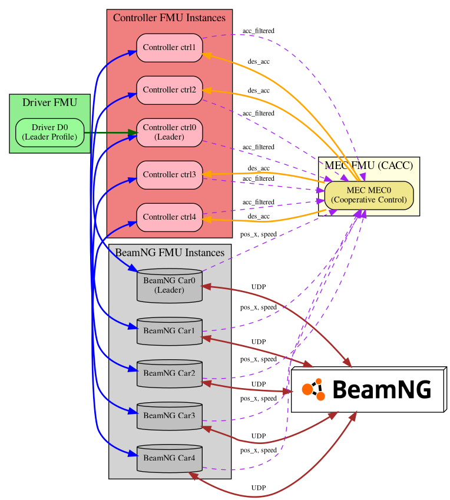

# Vehicle Platoon Co-Simulation

This project simulates vehicle platooning scenarios using co-simulation with [BeamNG.tech](https://beamng.tech/) and the FMI (Functional Mock-up Interface) standard.

## Overview

The simulation supports two communication architectures:
- **V2N (Vehicle-to-Network)**: Centralized control via a MEC (Multi-access Edge Computing) controller
- **V2V (Vehicle-to-Vehicle)**: Distributed control

The following diagram shows the FMU connections in the co-simulation in the case of V2N:



## Requirements

- BeamNG.tech simulator
- [Maestro](https://github.com/INTO-CPS-Association/maestro) co-simulation orchestration engine
- Python 3 with `beamngpy` library
- Make
- the required FMUs
   - the controller and driver can be found [here](https://github.com/ForeseenPRIN/platoon_controller_beam)
   - the MEC can be found [here](https://github.com/christianquadri/platoon_simulator)
   - the patched BeamNG FMU are found [here](https://github.com/scarburato/BeamNG-FMU), in the `modeldescfix` branch

## Quick Start

1. Place the required FMU files in the `FMUs/` directory
2. Configure simulation parameters in `options.env` (number of cars, etc.)
3. Run the simulation:
   ```bash
   make V2N    # For Vehicle-to-Network simulation
   make V2V    # For Vehicle-to-Vehicle simulation
   ```
4. In a separate shell, you may run:
   ```bash
   python plot.py --mec --csv build/modelV2N/outputs.csv
   # OR
   python plot.py --csv build/modelV2V/outputs.csv
   ```
   to plot the evolution of the system in real time

The simulation will:
- Generate the co-simulation configuration
- Launch BeamNG with a vehicle platoon
- Execute the co-simulation
- Save results to `build/modelV2N/` or `build/modelV2V/`

## Configuration

Edit `model.settings.json` to adjust:
- Simulation duration and step size
- Driver behavior parameters
- Control algorithm settings
- Logged variables

## Output

Results are saved as CSV files in the `build/` directory and can be visualized using the provided plotting scripts.

## Project Structure

- `generate_model.py` - Generates co-simulation configuration files
- `beam_start.py` - Launches BeamNG and sets up the vehicle platoon
- `model.settings.json` - Simulation parameters
- `FMUs/` - Functional Mock-up Units for vehicles and controllers

## TODO

- Add the p2p medium for network delays and packet loss
- Make `beam_start.py` launch with a different beam profile and set of UDP ports, so that the Makefile can be run with multiple jobs (2+ simulations at the same time)
